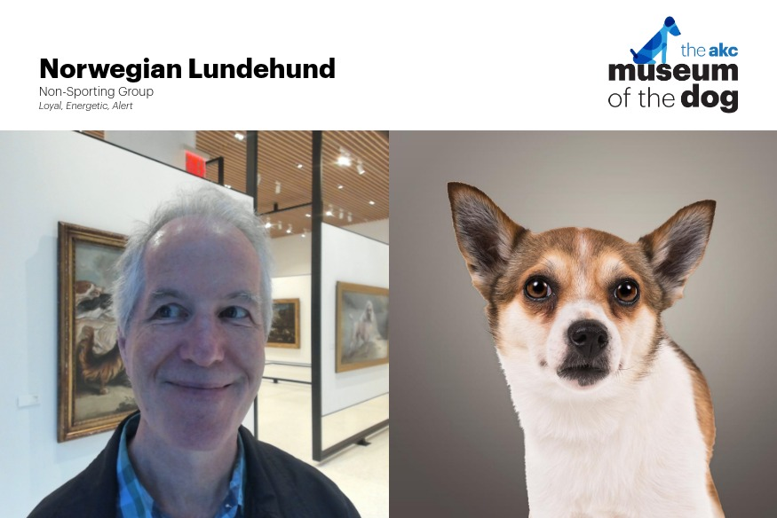
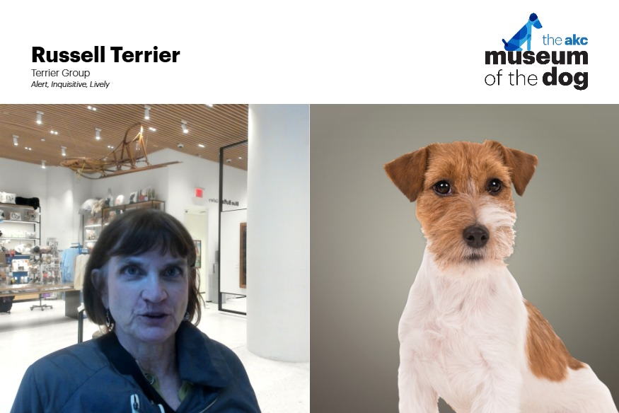

The [Museum of the Dog](https://museumofthedog.org/) in New York City is well worth visiting if you're interested in dogs.

There is a photo machine which takes your photo and matches your appearance with the closest matching dog.

Norwegian Lundehund - Loyal, energetic, alert:

Russell Terrier: Alert, inqusitive, lively:

