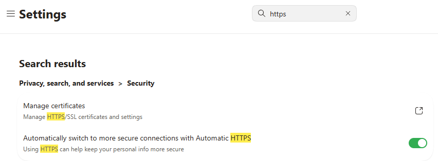

To improve security when browsing the web it is important to use secure pages (the HTTPS protocol).  To check the browser setting for automatic use of this protocol the following links will open the settings in Chrome and Edge.

In the past I've used the HTTPS Everywere browser extension.  It's good that this is no longer needed.

### Chrome

HTTPS [setting](chrome://settings/security)

### Edge

Edge HTTPS [setting](edge://settings/?search=https)

## More Information

Consumer Reports [guidance](https://securityplanner.consumerreports.org/tool/install-https-everywhere)
